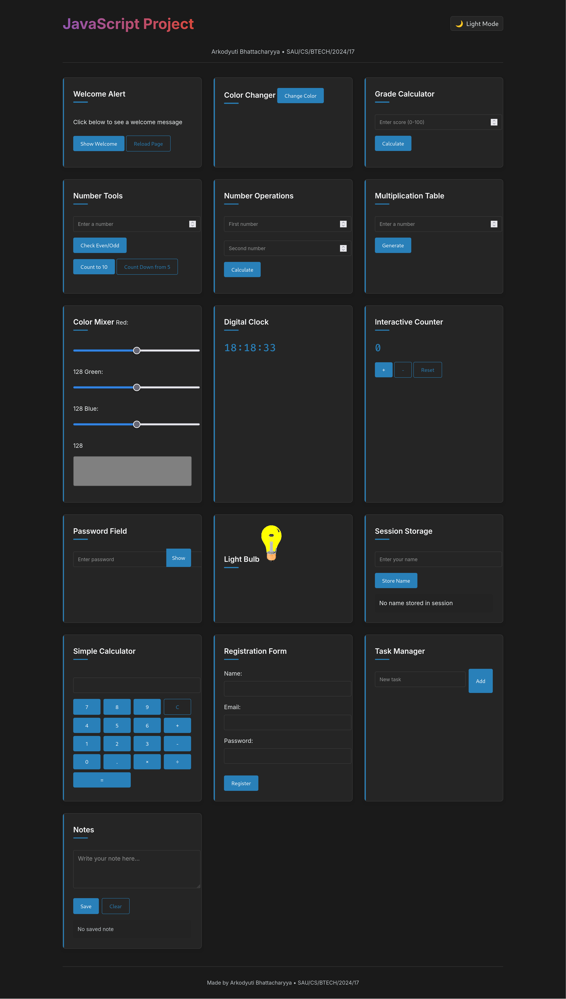

# JavaScript Project Portfolio 🌐

## About the Project
A collection of 20+ interactive JavaScript applications demonstrating core web development concepts, hosted live on GitHub Pages.

**Key Highlights**:
- 🎨 Theme-switching interface (light/dark mode)
- ⏱ Real-time digital clock
- 📝 Persistent notes application
- 🧮 Fully functional calculator
- ✅ Form validation systems
- 📊 Grade calculator
- 🗂 Task manager with localStorage

## Student Information
- **Name**: Arkodyuti Bhattacharyya
- **Institution**: South Asian University  
- **Program**: BTech in Computer Science  
- **Year**: 2024  
- **Student ID**: SAU/CS/BTECH/2024/17  

## Live Applications
Explore these interactive components directly on the live site:

| Feature | Description | 
|---------|-------------|
| Theme Toggler | Switch between light/dark modes | 
| Digital Clock | Real-time clock display |
| Color Mixer | RGB color generator | 
| Task Manager | Add/delete tasks | 
| Registration Form | Client-side validation | 

## Core Technologies:

Frontend: HTML5, CSS3, JavaScript (ES6+)

Design: Responsive layout, CSS transitions

Storage: localStorage, sessionStorage

Hosting: GitHub Pages

## How to Explore

Visit the live site: https://ark0b.github.io/Javascript-Projects/

Interact with any component

View source code on GitHub

## Development Insights

Through this project, I've:
✔ Implemented 15+ interactive JS applications

✔ Mastered DOM manipulation techniques

✔ Developed responsive UI components

✔ Created persistent data solutions

✔ Solved complex event handling scenarios

## Acknowledgments

Course instructors for foundational knowledge

MDN Web Docs for JavaScript references

Stack Overflow community for troubleshooting

## License

This project is open-source and available under the MIT License.

Developed with ♥ by Arkodyuti Bhattacharyya

South Asian University, 2024

